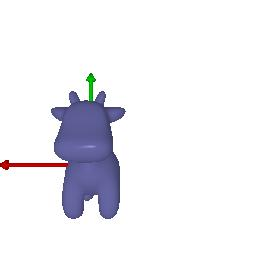
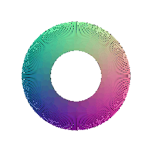

# CMSC848F: Assignment 1
**Submission By : Vineet Singh (email: vsingh03@umd.edu)**

# Section 0
-------------------------------------------------------------------------------

## Subsection 0.1
Rendering the first mesh

![Figure [robot]: Rendering the first mesh](results/cow_render.jpg)

# Section 1
-------------------------------------------------------------------------------

## Subsection 1.1
Creating a 360 degree view of the cow mesh

## Subsection 1.2
Creating the Dolly Zoom on cow mesh

# Section 2
-------------------------------------------------------------------------------

## Subsection 2.1
Creating a Tetrahedron mesh. The tetrahedron mesh should have 4 vertices, and 4 traingular faces (one for each face).

## Subsection 2.2
Creating a Cube mesh. A Cube mesh should have 8 vertices and 12 triangular faces, 
where each face of the cube consists of 2 traingular face.

# Section 3
-------------------------------------------------------------------------------
Re-texturing the mesh

The colours used are: 
color1 = [1, 0.5, 0]
color2 = [0.1, 1, 0]

# Section 4
-------------------------------------------------------------------------------
Camera Transformation on cow mesh: 

R_relative and T_relative basically gives the rotation and translation components for the extrinsic matrices of the camera. 
Based on the axis of rotation, R_relative takes different values for each of its elements. 
Similarly T_relative is 3*1 matrix with one element each for x, y, and z axis translation. 

The rotation and translation combination for each of the below images are: 

1st case values: R_relative=[[0, -1, 0], [1, 0, 0], [0, 0, 1]];  T_relative=[0, 0, 0]

2nd case values: R_relative=[[1, 0, 0], [0, 1, 0], [0, 0, 1]]; T_relative=[0, 0, 2]

3rd case values: R_relative=[[1, 0, 0], [0, 1, 0], [0, 0, 1]]; T_relative=[0.5, -0.5, 0]

4th case values: R_relative=[[0, 0, -1], [0, 1, 0], [1.0, 0, 0]]; T_relative=[3, 0, 3]

 

 

Own choice: R_relative=[[0, -1, 0], [1, 0, 0], [0, 0, 1]]; T_relative=[0.5, -0.5, 0]

# Section 5
-------------------------------------------------------------------------------
Rendering 3D generic Representations

## Subsection 5.1
Rendering Point Clouds from RGB-D Images

  

## Subsection 5.2
Parametric Functions

## Subsection 5.3
Implicit Surfaces

### My assessment: 
A point cloud is more accurate representation of the data as compared to the meshes but is more difficult 
to manipulate (edit or transform).
A mesh/surface rendering is faster for rendering and is easy to use but the memory 
requirements is much more compared to the point clouds.

# Instructions to reproduce the results

**submission_webpage.md.html** is the webpage submission for the assignment containing all the results.

A bash script is provided which will run all the script to generate output for all the sections. The main script file is **submission.py** 

1. Clone the repository on your machine and move inside to the cloned repository. 

2. First make the bash file executable by running the below command after navigating to this folder. 

    `chmod +x submission.sh`

2. Now run the script using the below command. This will run the script to generate all the output. The output results will be stored in results folder. 

    `./submission.sh`

3. After running the above script, Open the webpage to view all the results. 

## >Note: To generate output for individual sections use the below commands: 

   `python3 submission.py --question 0.1`

   ` python3 submission.py --question 1.1`
    
   `python3 submission.py --question 1.2`
    
   ` python3 submission.py --question 2.1`
    
   ` python3 submission.py --question 2.2`
    
   ` python3 submission.py --question 3`
    
   ` python3 submission.py --question 4`
    
   ` python3 submission.py --question 5.1`
    
   ` python3 submission.py --question 5.2`
    
   ` python3 submission.py --question 5.3`

